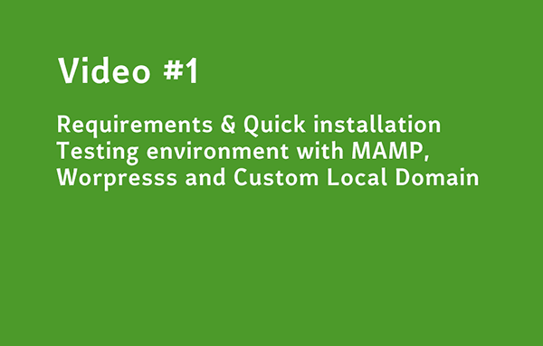

# Book #2 Defining a testing automation strategy for a P.O. with CODECEPTION_ & WordPress

**Below you can find information and code about this book for sale on Amazon: [https://www.amazon.com/dp/B0864VS2Y6/](https://www.amazon.com/dp/B0864VS2Y6/)**

[](https://www.amazon.com/dp/B0864VS2Y6/)


## Foreword
The 3 volumes of the continuous learning trilogy provide a practical synthesis on the best practices I gained as Trainer and Product Owner (P.O) of web application in the Media industry.  

- Book #1: The good and small "Zambian" guide for WordPress. How to run a News Website with WordPress?

- Book #2:  Defining a testing automation strategy for a P.O. with CODECEPTION_ & WordPress

- Book #3: Redefining a testing automation strategy for a P.O. with CodeceptJS & WordPress

1.  The Book #1 gathers all the materials that I brought with me to deliver a training session in Zambia to a team of journalists from the domestic network ZNBC on how to manage and run a news website. I made as intuitive and operational as possible. It has been transposed mostly to WordPress so anyone can leverage on it. It entails good practices under constraints such as budget, technical environment and team resources.

2.  The Book #2 & Book #3 present my understanding and practical experience of web application testing that I gained as Product Owner (P.O) in the Media industry. In these two books, I focus on user acceptance testing that is one of the biggest challenges for a PO of a large web application (back office, website).  How to minimize the risks of the acceptance phase?  How to master its duration? How to avoid regressions and side effects. Book #2 & Book #3 aim at answering those questions with the help of CP (Codeception) and CPJS (CodeceptJS).


## The continuous learning trilogy

### Book #1
**The good and small "Zambian" guide for WordPress. How to run a News Website with WordPress?**

- Github: [https://github.com/bflaven/book-small-guide-zambia-wordpress-running-news-website](https://github.com/bflaven/book-small-guide-zambia-wordpress-running-news-website)
- Amazon: [https://www.amazon.com/dp/B08645F8DZ/](https://www.amazon.com/dp/B08645F8DZ/)
- Youtube: [https://bit.ly/3bDSF2x](https://bit.ly/3bDSF2x) 

### Book #2
**Defining a testing automation strategy for a P.O. with CODECEPTION_ & WordPress**
- Github: [https://github.com/bflaven/book-defining-testing-strategy-agile-po-codeception](https://github.com/bflaven/book-defining-testing-strategy-agile-po-codeception)
- Amazon: [https://www.amazon.com/dp/B0864VS2Y6/](https://www.amazon.com/dp/B0864VS2Y6/)
- Youtube: [https://bit.ly/2UAGTic](https://bit.ly/2UAGTic)

### Book #3
**Redefining a testing automation strategy for a P.O. with CodeceptJS & WordPress**
- Github: [https://github.com/bflaven/book-redefining-testing-strategy-agile-po-codeceptjs](https://github.com/bflaven/book-redefining-testing-strategy-agile-po-codeceptjs)
- Amazon: [https://www.amazon.com/dp/B0865TT96K/](https://www.amazon.com/dp/B0865TT96K/)
- Youtube: [https://bit.ly/2UpWsdZ](https://bit.ly/2UpWsdZ)


## Acknowledgments

For book #2 & book #3, after a quick benchmark of the market solutions and the constraints that were mine, I totally relied on Codeception and CodeceptJS. I would like to take this opportunity to warmly thank to the Codeception (CP) and CodeceptJS (CPJS) team's excellent work and the remarkable documentation that accompanies it. Without this documentation, I believe that I would not have taken such a step.

[Codeception - https://codeception.com/](https://codeception.com/)

[CodeceptJS - https://codecept.io/](https://codecept.io/)

## Videos

**All the videos of this Book #2 are available on YouTube in this playlist: [https://bit.ly/2UAGTic](https://bit.ly/2UAGTic)**


- [Video #1 Building a testing environment with MAMP and Worpress with a Custom URL](https://www.youtube.com/watch?v=2yXS9mP3C_U)
[](https://www.youtube.com/watch?v=2yXS9mP3C_U)

- [Video #2 Writing the first test with your Codeception install](https://www.youtube.com/watch?v=4y967MWlnYI)
[](https://www.youtube.com/watch?v=4y967MWlnYI)

- [Video #3 Testing Post creation with Tags & Categories](https://www.youtube.com/watch?v=Iixub4_aiLM)
[](https://www.youtube.com/watch?v=Iixub4_aiLM)


- [Video #4 Testing WP API, WP Backoffice Multilingual, WP Frontoffice & using Gherkin](https://www.youtube.com/watch?v=Hp8ynDgB-2c)
[](https://www.youtube.com/watch?v=Hp8ynDgB-2c)

- [Video #5 Automate Testing with a single-click-app to launch the e2e UAT suite](https://www.youtube.com/watch?v=HNPD5tDm-Ps)
[](https://www.youtube.com/watch?v=HNPD5tDm-Ps)

- [Video #6 Using Docker to make Codeception & Wordpress working together](https://www.youtube.com/watch?v=x9BEsLzuhG0)
[](https://www.youtube.com/watch?v=x9BEsLzuhG0)

- [Video #7 Launching the "End To End" (E2E) suite to make the WP application's assessment](https://www.youtube.com/watch?v=B_4qnVUr1jY)
[](https://www.youtube.com/watch?v=B_4qnVUr1jY)

## Book Introduction

**Ignorant I was :)**

I must admit it: I have been slow to recognize the value of testing. As Product Owner (P.O) of a large project of backoffice for a News website, I found testing disappointing and useless. 
1. I did not see any significant impact of testing on software quality.

2. I thought tests were boring, time-consuming, expensive without immediate R.O.I

3. I did not find so far a tool that allows you to launch an ambitious testing strategy with a clear visibility on criteria like cost, ability to perform all types of test (unitary, functional and UAT),a good documentation, support from a mature development community, technical prerequisites etc.


As a result, I preferred manual testing procedure, based on a google doc or excel sheet. But I was wrong!  

**Tests are useful, incredibly time saving for a P.O. It strengthens confidence for the all team into a project. It can even be possibly cool. What an irony!**

And this book is the consequence of my “awaking” ;-)


## Code
**I try not to forget anything. The best thing to do is to make a fresh installation of CodeCeption (CP), finalize the configuration and then cut and paste the testing files one after the other with a WP running on custom URL in MAMP.**


``` bash
.
├── 1_Pioneer_or_Basic_Level # Chapter 1
│   ├── wordpress
│   │    ├── tests
│   │    │    ├── _data
│   │    │    ├── _output
│   │    │    ├── _support
│   │    │    ├── acceptance
│   │    │    ├── functional
│   │    │    ├── unit
│   │    │    ├── acceptance.suite.yml
│   │    │    ├── functional.suite.yml
│   │    │    └── unit.suite.yml
│   │    ├── codeception.yml  
│   │    └── composer.json
│   └── 1_Pioneer_or_Basic_Level.md # all commands used in this chapter
│
├── 2_Settler_advanced_level # Chapter 2
│   ├── wordpress
│   │    ├── tests
│   │    │    ├── _data
│   │    │    ├── _output
│   │    │    ├── _support
│   │    │    ├── acceptance
│   │    │    │     ├──BackCest.php
│   │    │    │     ├──CheckWpBackAddAJournalistProfileCest.php
│   │    │    │     ├──CheckWpBackAddPostCategoryCest.php
│   │    │    │     ├──CheckWpBackAddPostTagCest.php
│   │    │    │     ├──CheckWpBackCest.php
│   │    │    │     ├──CheckWpBackCreateAdvancedPostCest.php
│   │    │    │     ├──CheckWpBackCreateAdvancedPostPlusCest.php
│   │    │    │     ├──CheckWpBackCreatePostCest.php
│   │    │    │     ├──CheckWpBackCreateShortcodePostCest.php
│   │    │    │     ├──CheckWpBackDeletePostCategoryCest.php
│   │    │    │     ├──CheckWpBackDeletePostTagCest.php
│   │    │    │     ├──CheckWpBackNewPluginSearchAndInstallPluginsDirectoryCest.php
│   │    │    │     ├──CheckWpBackNewPluginUploadZipInstallCest.php
│   │    │    │     ├──CheckWpBackNewThemeSearchThemesDirectoryCest.php
│   │    │    │     ├──CheckWpBackNewThemeUploadZipInstallCest.php
│   │    │    │     ├──CheckWpBackNewThemeUploadZipInstallPlusCest.php
│   │    │    │     ├──CheckWpBackPluginActivationCest.php
│   │    │    │     ├──CheckWpBackPluginDeactivationCest.php
│   │    │    │     ├──CheckWpBackUploadNewMediaCest.php
│   │    │    │     ├──CheckWpFrontCest.php
│   │    │    │     ├──CheckWpFrontJournalistProfileArchiveDetailsCest.php
│   │    │    │     ├──CheckWpFrontModifyHeaderFooterCest.php
│   │    │    │     ├──CheckWpFrontTargetHomepageCest.php
│   │    │    │     ├──FrontCest.php
│   │    │    │     ├──SuperDuperCest.php
│   │    │    ├── functional
│   │    │    ├── unit
│   │    │    ├── acceptance.suite.yml
│   │    │    ├── functional.suite.yml
│   │    │    └── unit.suite.yml
│   │    ├── codeception.yml  
│   │    └── composer.json
│   └── 2_Settler_advanced_level.md # all commands used in this chapter
│
├── 3_Leader_expert_level # Chapter 3
│   ├── wordpress-codeception-distrib-4 # a distribution for CP only working with WP on MAMP
│   ├── wordpress-codeception-distrib-docker # a distribution with WP in Docker with .env & Makefile
│   └── 3_Leader_expert_level.md # all commands used in this chapter
│
│──  wp_testing_source # The WP used for the testing strategy (db, plugins...etc)
└──  README.md #This file

```

## Table of content

### I. Why is this book done?   
    1 Why Now? 
    2 Why CODECEPTION_ (CP)?   
    3 Why WordPress (WP)?  
    4 Caution  
### II. How This book Is Structured?    
    This book contains 3 big chapters  
    1 Pioneer or Basic Level   
    2 Settler or Advanced Level    
    3 Leader or Expert Level   
### III. Who is this book for?  
    Both as PO and Trainer  
    1 Technology You Need to Understand    
    2 What can you expect from the reading of this book ?  
    3 Online Content   
    4 Conventions Used in This Book    
    5 Acknowledgments  
### IV. The Importance of Testing   
    Understand the importance of testing    
#### 1. Pioneer or Basic Level   
    Quickest way to discover CP 
    1.1 Using MAMP  
    1.2 Custom address for WP in MAMP   
    1.3 Installing a WP in MAMP 
    1.4 Installing CodeCeption with the .phar file  
    HEADS-UP: CodeCeption, WP & MAMP   
    1.5 Frontoffice: Writting a first test for WP   
    1.6 Backoffice: Writting a first test for WP Admin  
    1.7 Extra explanations for Backoffice & Frontoffice.    
    1.8 Conclusion for Pioneer or Basic Level   

#### 2. Settler or Advanced Level    
    Move up to a higher level   
    2.1 Install composer on your computer   
    2.2 Naming convention for your testing strategy 
    2.3 Food for thought : how to "map" an application  
    HEADS-UP: Naming Conventions    
    2.4 Applying these principles to you testing strategy with CP   
    2.5 O.O.P for NOOBs, the Class logic revealed   
    2.6 Internalization: Languages & Tests. 
    2.7 I test, you test, we test...   
    2.8 Tests for WP Settings   
    2.9 Tests for Posts 
    2.10 Tests for Categories and Tags  
    2.11 Test for image upload  
    2.12 Test for WP plugin 
    2.13 Test for WP theme  
    2.14 Test for WP Custom Post Types and Custom Taxonomy  
    2.15 Testing the impact of a plugin on the front    
    2.16 Conclusion for Settler 

#### 3. Leader or Expert Level   
    Integrating the best practices  
    3.1 Using codeception distribution  
    3.2 Using Suite in Distribution_1 (codeception-distrib-4)   
    3.3 Using CP to make other testing: functional testing  
    3.4 Using CP to make other testing: unit testing    
    3.5 Using Gherkin and .features for acceptance testing  
    3.6 Using pageObject Model for acceptance testing   
    3.7 Using stepObject for acceptance testing 
    3.8 Using dependency injection  
    3.9 Using advanced annotation   
    3.10 Using Docker   
    3.11 How to automate your tests?    

#### 4. Conclusion   
    Conclusion  

### Resources   
    Code avalaible  

### Lexicon 
    Some Definitions    


